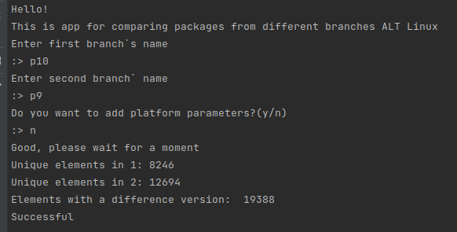
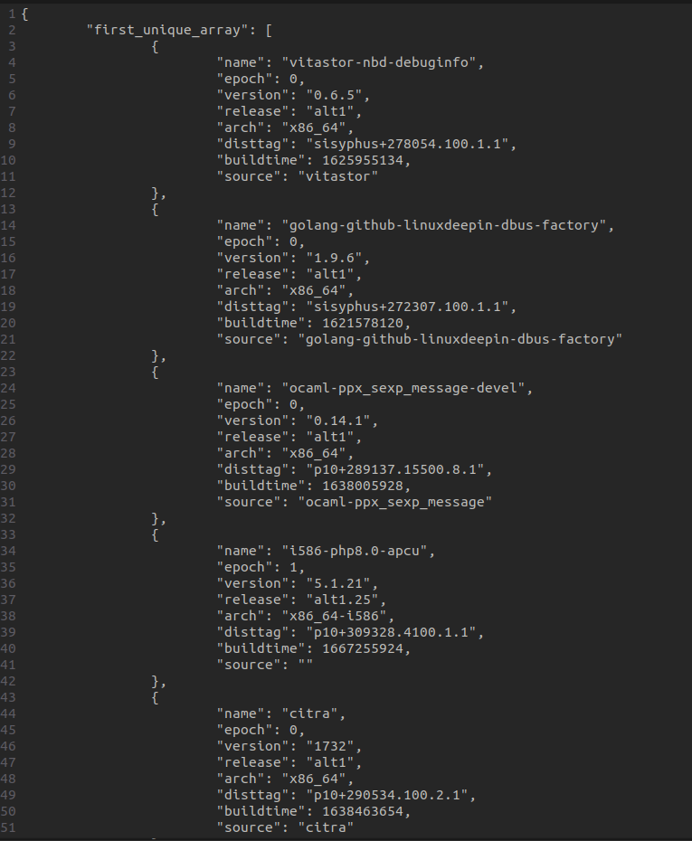

# ALTComparing
## About the project.

This is a CLI App for comparing binary packages from different branches ALTLinux API.

URL for request:
```
 https://rdb.altlinux.org/api/export/branch_binary_packages
```
App is written using Golang.
With the help of this app, you can make request to ALT API, and get a list of packages in two selected branches,
then a file with a compression is formed from this list.
With the help of received json file, you can find out:
1. What packages are in the first branch but not in the second branch
2. What packages are in the second branch but not in the first branch
3. In which packages of the first branch the version is greater than in the packages of second branch

## How to use
Build and run app. You will see a greeting, and you will be asked to enter the of the branches.
Also, you can enter arch params(optional)
Then you have to wait for the program to finish.

You will see such a picture in case of completion 
<p align="center">
    
</p>
And there will be a json file in ./data/
<p align="center">
    
</p>

## Logs 
Logs are stored in ```/var/log/altbranchcompare.d/"```
## Project structure
```
|-- cmd // folder with entry point(main.go)
|-- pkg- // folder with pkg, that are used in the project
|   |-- API // pkg for request to API
|   |-- logger // pkg for logging
|   |-- IO // pkg for CLI control
|   |-- VersionComprator// pkg for compare rpm versions
|-- readme_assets // folder with files for README
```

### Project setup
```
make install (!!RUN FROM ROOT!!)
```
### Flag
```
-p pathToResultDir(without '/' at end)
```

#### This application has been tested on Linux.